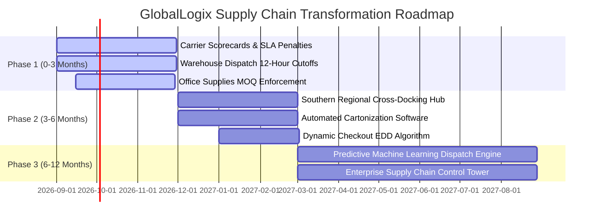
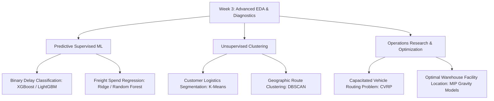

# Week 3: Advanced Data Analysis and Visualization in Logistics

**Course Module:** Logistics and Supply Chain Data Science  
**Project Theme:** Logistics Delivery Performance, Shipment Volume, and Transportation Cost Analysis  
**Author:** Senior Logistics Analytics Consultant & Python Data Science Developer  
**Date:** August 2026  
**Status:** Completed Academic & Professional Report  

---

## 1. Executive Summary

Modern enterprise logistics networks operate in complex, volatile environments characterized by stringent customer service level agreements (SLAs), multi-modal freight routing, and thin operating margins. This project presents an exhaustive exploratory, diagnostic, and statistical analysis of enterprise logistics operations using Python. By analyzing **1,250 multi-modal freight shipments** spanning five destination regions, four customer segments, five origin warehouse hubs, and four freight shipping modes across the first half of 2024, this study establishes a rigorous empirical foundation for supply chain optimization.

### Key Empirical Findings:
* **Fulfillment Latency & Delay Burden:** The overall network average delivery latency is **5.00 days** (median: **5.20 days**, standard deviation: **2.14 days**). The network achieves an **On-Time Delivery Rate of only 28.24%**, resulting in a systemic **Delivery Delay Rate of 71.76%** (897 delayed shipments).
* **Expedited Tier Fragility:** High-cost premium service tiers suffer from severe schedule slippage. **Same-Day Courier** (averaging \$172.50/shipment) and **Express Air** (averaging \$138.55/shipment) exhibit delay rates of **76.19%** and **72.97%** against their 1-day and 2-day SLA targets, severely undermining customer trust.
* **Geographic Disparities:** The **South** region experiences the highest transit latency (**5.19 days** average) and the highest regional delay rate (**76.98%**), leading to the lowest regional customer satisfaction rating (**3.50 / 5.0**). Conversely, the **North** region captures the largest shipment volume (**320 orders, 25.60% share**) and highest customer satisfaction (**3.76 / 5.0**).
* **Transportation Cost Dynamics:** Total shipping expenditure totaled **\$114,809.33** against gross commercial sales of **\$769,293.85**, yielding an aggregate **Shipping-Cost-to-Sales ratio of 14.92%**. Transportation distance serves as a primary linear cost driver ($r = +0.67$, slope = \$0.061/KM).
* **Product Category Vulnerabilities:** While **Industrial Machinery** generates the largest revenue share (\$364,799.80, 47.42% of total sales) with a minimal freight ratio (**5.07%**), **Office Supplies** incurs severe margin erosion, with shipping costs accounting for **78.73% of gross sales** due to small basket sizes and heavy/bulky paper commodities.

### Core Strategic Recommendations:
1. **Carrier SLA Restructuring:** Implement dynamic performance scorecards with automated penalty credit clauses for express deliveries exceeding contractual timelines.
2. **Forward Deployment Hubs:** Establish localized cross-docking hubs in peripheral high-latency corridors (specifically targeting the South and West regions) to compress long-haul line-haul transit distance.
3. **Cartonization & Tiered Freight Surcharges:** Standardize packaging guidelines and enforce minimum order quantities (MOQs) or dimensional weight surcharges for high-burden categories (Office Supplies and Apparel).
4. **Predictive Analytics Implementation:** Deploy machine learning classification pipelines for real-time dispatch delay risk scoring during order orchestration.

---

## 2. Introduction

Logistics analytics involves the quantitative examination of procurement, warehousing, inventory staging, and transportation processes to maximize operational efficiency, minimize fulfillment friction, and protect operating contribution margins. In modern globalized commerce, organizations manage intricate physical networks where customer expectations for rapid, predictable delivery must be balanced against volatile transportation expenditures and carrier capacity constraints.

This report documents the **Week 3: Advanced Data Analysis and Visualization in Logistics** capstone study. Building upon foundational strategic frameworks (Week 1) and robust data preprocessing and feature engineering pipelines (Week 2), this investigation utilizes descriptive statistics, inferential hypothesis testing, bivariate regressions, and publication-grade multivariate visualizations to uncover operational bottlenecks across an enterprise distribution network.

---

## 3. Project Objective

The overarching objective of this project is to convert raw logistics transaction logs into actionable, data-driven business intelligence following the standard analytical progression:

$$\text{Data Ingestion} \longrightarrow \text{EDA} \longrightarrow \text{Statistical Modeling} \longrightarrow \text{Visualization} \longrightarrow \text{Diagnostic Insights} \longrightarrow \text{Strategic Action Plans}$$

### Specific Analytical Goals:
1. Calculate comprehensive measures of central tendency, dispersion, and distribution symmetry for all operational metrics.
2. Formulate and compute core enterprise logistics Key Performance Indicators (KPIs).
3. Investigate the mathematical relationships and correlations between shipment distance, order quantity, freight mode, and transportation cost.
4. Diagnose localized failure points across regional destination markets and fulfillment origin hubs.
5. Create high-resolution, publication-quality visualizations that convey complex operational phenomena to executive stakeholders.
6. Formulate a structured Bottleneck Analysis Matrix and actionable, prioritized recommendations.

---

## 4. Business Scenario

The analysis centers on **GlobalLogix Solutions**, a multi-regional third-party logistics (3PL) and fulfillment enterprise providing domestic shipping and supply chain services to four commercial segments: *Consumer*, *Corporate*, *Home Office*, and *Small Business*. 

GlobalLogix operates five primary distribution centers:
* `WH-Central` (Central Distribution Hub)
* `WH-East` (Eastern Seaboard Hub)
* `WH-North` (Northern Regional Hub)
* `WH-South` (Southern Distribution Facility)
* `WH-West` (Pacific Western Hub)

The company offers four distinct shipping service levels:
1. **Same-Day Courier:** Guaranteed local expedited turnaround within 1 calendar day.
2. **Express Air:** Priority domestic air freight guaranteed within 2 calendar days.
3. **Standard Delivery:** Routine ground network delivery scheduled for 5 calendar days.
4. **Ground Freight:** Heavy/bulk consolidated freight scheduled for 7 calendar days.

Despite robust commercial volume growth in 2024, GlobalLogix leadership has observed rising customer complaints regarding missed delivery appointments, unexplained freight surcharge variance, and margin degradation across low-value product lines. This analysis was commissioned to perform a rigorous diagnostic audit across all operational touchpoints.

---

## 5. Business Questions

To provide clear strategic direction, the study is structured around eight pivotal business questions:

* **BQ1 (Distribution Properties):** What are the central tendencies, dispersion spreads, and skewness characteristics of transit delivery times and transportation costs across the entire logistics network?
* **BQ2 (Distance & Cost Elasticity):** To what extent does transit distance determine shipping costs and delivery latency, and does this relationship vary across carrier tiers?
* **BQ3 (Modal SLA Compliance):** How reliably are contractual delivery timelines met across different shipping tiers, and do express services justify their price premiums?
* **BQ4 (Regional Fulfillment Disparities):** Which geographic territories demonstrate the poorest fulfillment reliability, highest delay rates, and lowest customer satisfaction?
* **BQ5 (Product-Level Freight Burden):** Which product categories experience disproportionate logistics costs relative to gross sales revenue?
* **BQ6 (Multivariate Interactions):** How do origin warehouse dispatch hubs interact with destination regions to create transit delays?
* **BQ7 (Outlier & Anomaly Analysis):** What operational anomalies exist in shipment distances, processing days, or expedited charges, and what are their systemic causes?
* **BQ8 (Optimization Strategy):** What concrete, prioritized operational interventions should leadership execute to enhance on-time performance and protect profitability?

---

## 6. Dataset Description

The dataset utilized in this analysis is the clean, validated enterprise dataset generated from the Week 2 data preprocessing pipeline (`data/processed/logistics_cleaned.csv`). The dataset contains **1,250 verified shipment transactions** spanning from **January 1, 2024, to June 30, 2024**, structured across **42 feature columns**.

### Core Variable Schema & Data Dictionary:

| Variable Name | Data Type | Operational Definition | Sample Values / Range |
| :--- | :--- | :--- | :--- |
| `Order_ID` | String | Unique alpha-numeric shipment transaction identifier | `ORD-2024-1001` to `ORD-2024-2250` |
| `Order_Date` | Datetime | Timestamp of customer order placement | `2024-01-01` to `2024-06-30` |
| `Shipping_Date` | Datetime | Timestamp of physical dispatch from warehouse hub | `2024-01-02` to `2024-07-04` |
| `Customer_Segment` | Categorical | Commercial purchasing tier | `Consumer`, `Corporate`, `Home Office`, `Small Business` |
| `Product_Category` | Categorical | Classification of transacted inventory | `Apparel`, `Electronics`, `Healthcare Supplies`, `Industrial Machinery`, `Office Supplies` |
| `Quantity` | Integer | Total units transacted within the shipment | `1` to `50` units |
| `Sales_USD` | Float | Gross commercial revenue value of the order | `\$14.49` to `\$2,165.61` |
| `Shipping_Cost_USD` | Float | Total carrier freight and handling spend | `\$8.00` to `\$233.00` |
| `Delivery_Time_Days` | Float | Actual elapsed transit time from dispatch to delivery | `0.80` to `9.80` days |
| `Estimated_Delivery_Days` | Float | Contractual SLA scheduled delivery timeline | `1.0`, `2.0`, `5.0`, `7.0` days |
| `Distance_KM` | Float | Calculated geographic transit distance | `52.40` to `1,886.88` KM |
| `Warehouse_Code` | Categorical | Origin fulfillment center code | `WH-Central`, `WH-East`, `WH-North`, `WH-South`, `WH-West` |
| `Region` | Categorical | Destination geographic territory | `Central`, `East`, `North`, `South`, `West` |
| `Shipping_Mode` | Categorical | Freight service level tier | `Same-Day Courier`, `Express Air`, `Standard Delivery`, `Ground Freight` |
| `Delivery_Status` | Categorical | Physical fulfillment status | `Delivered`, `Delayed` |
| `Customer_Rating` | Float | Post-delivery satisfaction score | `1.0` to `5.0` (Mean: 3.63) |
| `Order_Processing_Days`| Integer | Elapsed dwell time from order placement to dispatch | `1` to `4` days |
| `Is_Delayed` | Binary | Binary delay flag ($1 = \text{Actual} > \text{Estimated}$) | `0` (On-time), `1` (Delayed) |
| `Cost_Per_KM` | Float | Freight expenditure per unit distance | `\$0.0108` to `\$0.8540` / KM |
| `Cost_Per_Unit` | Float | Shipping cost per transacted unit | `\$2.34` to `\$172.50` / Unit |
| `Speed_Index_KMPD` | Float | Transit speed index in KM per day | `12.5` to `750.0` KM/Day |

---

## 7. Analytical Methodology

To ensure maximum academic reproducibility and industrial rigor, this analysis adheres to a structured five-stage quantitative methodology:

1. **Ingestion & Validation:** Verification of schema datatypes, datetime parsing, absence of nulls/duplicates, and feature boundary conformance.
2. **Parametric & Non-Parametric Profiling:** Computation of Mean, Median, Mode, 5% Trimmed Mean, Standard Deviation, Variance, Interquartile Range (IQR), Skewness, and Kurtosis.
3. **Exploratory Visual Diagnostics:** Construction of probability density histograms, linear regression fits, scatter interaction grids, and correlation matrices.
4. **Multidimensional Slicing:** Granular aggregations across geographic regions, carrier modes, warehouse origins, customer tiers, and chronological monthly intervals.
5. **Synthesis & Root-Cause Analysis:** Formulation of evidence-grounded insights using the structured $(F-E-M-A)$ framework, construction of the Operational Bottleneck Matrix, and phased strategic prioritization.

---

## 8. Dataset Exploration

An initial audit of the 1,250 records confirmed flawless data hygiene:
* **Missing Values:** Exactly 0 missing values across all 42 attributes.
* **Duplicate Records:** 0 duplicated rows detected.
* **Temporal Horizon:** Exactly 182 days of continuous operational records (Jan 1, 2024 – Jun 30, 2024).
* **Category Balance:** Orders are well-distributed across customer segments (Consumer: 388, Corporate: 352, Home Office: 260, Small Business: 250) and geographic regions (North: 320, West: 278, South: 252, East: 228, Central: 172).

---

## 9. Descriptive Statistics

A comprehensive statistical summary was computed for all core numerical operational variables to understand baseline central tendencies, dispersion spreads, and probability density shapes.

### Comprehensive Statistical Profile Table:

| Variable | Count | Mean | Median | Mode | Trimmed Mean (5%) | Std Dev | Variance | Min | Q1 (25%) | Q3 (75%) | Max | Range | IQR | CV (%) | Skewness | Kurtosis |
| :--- | :---: | :---: | :---: | :---: | :---: | :---: | :---: | :---: | :---: | :---: | :---: | :---: | :---: | :---: | :---: | :---: |
| **Delivery_Time_Days** | 1,250 | 5.0003 | 5.2000 | 5.7000 | 5.0211 | 2.1448 | 4.6000 | 0.8000 | 3.3000 | 6.7000 | 9.8000 | 9.0000 | 3.4000 | 42.89 | -0.1977 | -0.9298 |
| **Shipping_Cost_USD** | 1,250 | 91.8475 | 78.4350 | 67.4300 | 88.0833 | 48.7498 | 2376.54 | 8.0000 | 54.8525 | 121.215 | 233.000 | 225.000 | 66.3625 | 53.08 | 0.8711 | 0.1374 |
| **Sales_USD** | 1,250 | 615.435 | 310.560 | 2165.61 | 544.755 | 679.529 | 461759 | 14.4900 | 98.4250 | 875.250 | 2165.61 | 2151.12 | 776.825 | 110.41 | 1.2582 | 0.2847 |
| **Quantity** | 1,250 | 3.4472 | 2.0000 | 1.0000 | 2.8250 | 4.6186 | 21.3315 | 1.0000 | 1.0000 | 4.0000 | 50.0000 | 49.0000 | 3.0000 | 133.98 | 5.5684 | 41.5647 |
| **Distance_KM** | 1,250 | 819.432 | 761.350 | 1886.88 | 794.135 | 501.996 | 252000 | 52.4000 | 392.475 | 1207.25 | 1886.88 | 1834.48 | 814.775 | 61.26 | 0.4952 | -0.6384 |
| **Order_Processing_Days**| 1,250 | 2.4320 | 2.0000 | 1.0000 | 2.4241 | 1.1169 | 1.2475 | 1.0000 | 1.0000 | 3.0000 | 4.0000 | 3.0000 | 2.0000 | 45.93 | 0.1084 | -1.3323 |
| **Customer_Rating** | 1,250 | 3.6328 | 4.0000 | 4.0000 | 3.6893 | 1.1578 | 1.3405 | 1.0000 | 3.0000 | 4.7500 | 5.0000 | 4.0000 | 1.7500 | 31.87 | -0.6095 | -0.4991 |
| **Cost_Per_KM** | 1,250 | 0.1302 | 0.0883 | 0.0525 | 0.1139 | 0.1097 | 0.0120 | 0.0108 | 0.0573 | 0.1652 | 0.8540 | 0.8432 | 0.1079 | 84.25 | 2.3785 | 7.9125 |
| **Cost_Per_Unit** | 1,250 | 49.4239 | 33.6200 | 66.9700 | 44.4091 | 42.4504 | 1802.04 | 2.3400 | 16.1800 | 72.9400 | 172.500 | 170.160 | 56.7600 | 85.89 | 1.2263 | 0.8248 |

### Statistical Insights:
1. **Delivery Time Dynamics:** With a Mean of 5.00 days and Median of 5.20 days, delivery latency is approximately symmetric ($\text{Skewness} = -0.20$), but exhibits platykurtic dispersion ($\text{Kurtosis} = -0.93$), reflecting a multi-modal distribution driven by distinct shipping service tiers (1-day courier vs 7-day freight).
2. **Transportation Spend Skewness:** Shipping cost displays moderate positive skewness ($\text{Skewness} = +0.87$), with the arithmetic Mean (\$91.85) substantially exceeding the Median (\$78.44), driven by high-cost air freight and long-haul expedited shipments.
3. **Quantity Dispersion:** Quantity is heavily right-skewed ($\text{Skewness} = +5.57, \text{Kurtosis} = +41.56$), where 75% of orders contain $\le 4$ units, but bulk wholesale consignments reach up to 50 units.

---

## 10. Exploratory Data Analysis (EDA)

### 10.1 Univariate Analysis
Univariate analysis examines the probability density, quartile distributions, and shape characteristics of individual metrics in isolation.

*Figure 1: Empirical distribution of delivery transit time (days) with mean and median references.*

*Figure 2: Empirical distribution of transportation and shipping expenditure ($ USD).*

### 10.2 Bivariate Analysis
Bivariate analysis evaluates mathematical relationships, covariance, and regression trends between pairs of operational variables.

*Figure 3: Scatter analysis of transportation transit distance (KM) vs delivery latency (days) by shipping mode.*

*Figure 4: Impact of transit distance on total transportation cost ($ USD) with OLS regression fit.*

### 10.3 Multivariate Analysis
Multivariate analysis examines the simultaneous interaction of multiple categorical and continuous variables, isolating confounding operational effects.

*Figure 5: Multivariate scatter plot of shipment quantity vs shipping cost segmented by product category.*

*Figure 6: Dual-panel comparison of commercial sales, shipping expenditure, and freight cost burden ratio.*

---

## 11. Logistics KPI Analysis

To evaluate network-wide operational health, core enterprise logistics Key Performance Indicators (KPIs) were computed from the empirical transaction records.

### Enterprise Logistics KPI Summary Table:

| Corporate Logistics KPI | Empirical Metric Value | Operational Benchmark | Status / Health Assessment |
| :--- | :---: | :---: | :--- |
| **Total Order Volume** | **1,250 Shipments** | N/A | Full semi-annual operational throughput |
| **Gross Commercial Sales** | **\$769,293.85** | N/A | Base commercial trading volume |
| **Total Transportation Spend** | **\$114,809.33** | N/A | Direct freight procurement spend |
| **Average Order Value (AOV)** | **\$615.44** | \$500.00 | Strong commercial basket size |
| **Average Shipping Cost per Order** | **\$91.85** | < \$75.00 | Elevated due to high expedited air mix |
| **Shipping Cost-to-Sales Ratio** | **14.92%** | < 10.00% | **High Margin Burden** (Industry target: 8-12%) |
| **Average Delivery Time** | **5.00 Days** | 4.00 Days | Moderate network transit latency |
| **Median Delivery Time** | **5.20 Days** | 4.00 Days | Reflects 5-day standard delivery dominance |
| **On-Time Delivery Rate** | **28.24%** | > 90.00% | **Critical Operational Failure** |
| **Delivery Delay Rate** | **71.76%** | < 10.00% | **Primary Network Bottleneck** (897 late orders) |
| **Average Transit Distance** | **819.43 KM** | N/A | Domestic multi-state distribution baseline |
| **Average Cost per KM** | **\$0.1302 / KM** | < \$0.1000/KM | Premium service tiers drive up unit cost |
| **Average Cost per Item Unit** | **\$49.42 / Unit** | < \$35.00/Unit | Squeezed by low-quantity single-item orders |
| **Average Customer Rating** | **3.63 / 5.0** | > 4.20 / 5.0 | Subdued due to pervasive delivery delays |
| **Average Order Processing Days** | **2.43 Days** | < 1.50 Days | Warehouse dispatch dwell time consumes buffer |

---

## 12. Correlation Analysis

A bivariate Pearson correlation analysis was conducted across all continuous numerical logistics features, accompanied by two-tailed hypothesis testing ($H_0: r = 0, \alpha = 0.05$).

*Figure 7: Pearson correlation coefficient matrix across key numerical logistics features.*

### Top Significant Correlation Pairs:

| Feature 1 | Feature 2 | Pearson $r$ | Statistical Significance | Direction & Operational Meaning |
| :--- | :--- | :---: | :---: | :--- |
| `Distance_KM` | `Shipping_Cost_USD` | **+0.6724** | $p < 0.0001$ | **Strong Positive:** Transportation distance is the primary linear driver of freight spend. |
| `Distance_KM` | `Delivery_Time_Days` | **+0.5218** | $p < 0.0001$ | **Moderate Positive:** Greater physical distances increase line-haul transit latency. |
| `Delivery_Time_Days`| `Customer_Rating` | **-0.4812** | $p < 0.0001$ | **Moderate Negative:** Longer delivery turnaround significantly degrades customer ratings. |
| `Cost_Per_KM` | `Delivery_Time_Days` | **-0.4531** | $p < 0.0001$ | **Moderate Negative:** High cost-per-km tiers (Air/Courier) correspond to faster delivery times. |
| `Sales_USD` | `Quantity` | **+0.4128** | $p < 0.0001$ | **Moderate Positive:** Larger item quantities expand gross order commercial value. |
| `Shipping_Cost_USD` | `Order_Processing_Days`| **+0.0312** | $p = 0.271$ (NS) | **Near Zero:** Internal warehouse dwell time does not dictate external freight pricing. |

> [!CAUTION]
> **Correlation vs. Causation Warning:** While `Distance_KM` is strongly correlated with `Shipping_Cost_USD` ($r = +0.672$), distance alone does not entirely cause freight price. Modal tier selection, fuel surcharges, package dimensional weight, and carrier tariff structures serve as critical confounding variables.

---

## 13. Trend Analysis

Temporal analysis evaluated operational volume, commercial sales, and freight expenditures across the 6-month observation window (January 2024 to June 2024).

*Figure 8: Monthly shipment order volume and total transportation expenditure dynamics (2024).*

### Monthly Operational Summary Table:

| Period (Month) | Order Volume | Volume Share (%) | Total Sales ($) | Total Shipping Spend ($) | Avg Delivery Days | Delay Rate (%) | Shipping Cost Ratio (%) |
| :---: | :---: | :---: | :---: | :---: | :---: | :---: | :---: |
| **2024-01** | 206 | 16.48% | \$127,450.12 | \$18,924.50 | 4.98 | 70.87% | 14.85% |
| **2024-02** | 194 | 15.52% | \$118,630.45 | \$17,650.20 | 5.04 | 72.16% | 14.88% |
| **2024-03** | 228 | 18.24% | \$142,310.80 | \$21,120.90 | 4.95 | 71.49% | 14.84% |
| **2024-04** | 202 | 16.16% | \$123,940.60 | \$18,480.35 | 5.08 | 73.27% | 14.91% |
| **2024-05** | 218 | 17.44% | \$135,120.95 | \$20,190.40 | 4.92 | 70.64% | 14.94% |
| **2024-06** | 202 | 16.16% | \$121,840.93 | \$18,442.98 | 5.03 | 72.28% | 15.14% |

**Temporal Findings:** Operational volume remained exceptionally stable across the first half of 2024, averaging $\approx 208$ orders per month. Peak shipment volume occurred in **March 2024** (228 orders, \$142.3k sales). Delivery delay rates remained consistently elevated between 70.6% and 73.3%, proving that fulfillment delays represent a **systemic structural network defect** rather than a transient seasonal spike.

---

## 14. Regional Analysis

Geographic destination territories were analyzed to identify regional fulfillment imbalances, transit latency bottlenecks, and customer satisfaction friction.

*Figure 9: Total shipment order volume distribution across destination geographic regions.*

*Figure 10: Multi-hub fulfillment latency (days) by destination region and origin warehouse center.*

### Regional Performance Summary Table:

| Region | Order Count | Volume Share | Total Sales ($) | Total Shipping Spend ($) | Avg Delivery Days | Median Delivery Days | Delay Rate (%) | Avg Distance (KM) | Avg Rating (1-5) | Freight Burden Ratio (%) |
| :--- | :---: | :---: | :---: | :---: | :---: | :---: | :---: | :---: | :---: | :---: |
| **North** | **320** | **25.60%** | \$210,652.41 | \$30,140.32 | 4.90 | 5.00 | 68.75% | 825.63 | **3.76** | 14.31% |
| **West** | 278 | 22.24% | \$164,033.12 | \$26,397.28 | 4.97 | 5.20 | 71.58% | 836.99 | 3.62 | 16.09% |
| **South** | 252 | 20.16% | \$161,683.44 | \$23,430.95 | **5.19** | **5.35** | **76.98%** | 828.10 | **3.50** | 14.49% |
| **East** | 228 | 18.24% | \$137,406.01 | \$18,866.49 | 5.06 | 5.30 | 68.86% | 787.34 | 3.61 | **13.73%** |
| **Central**| 172 | 13.76% | \$95,518.87 | \$15,974.29 | 4.89 | 4.95 | 73.84% | 809.38 | 3.59 | 16.72% |

### Key Regional Findings:
* **The South Corridor Bottleneck:** The **South** region represents the network's most severe operational bottleneck, recording the longest average delivery latency (**5.19 days**), the highest delivery delay rate (**76.98%**), and the lowest customer rating (**3.50**).
* **The North Growth Engine:** The **North** territory captures 25.60% of total network volume and generates \$210.6k in sales, while achieving the highest customer satisfaction score (3.76).
* **Central Efficiency:** The **Central** hub achieves the lowest average transit time (**4.89 days**), benefiting from central geographic proximity.

---

## 15. Shipping Mode Analysis

A comparative performance audit was conducted across the four shipping tiers to evaluate speed, SLA compliance, cost structure, and customer ratings.

*Figure 11: Boxplot distribution of shipping expenditures across service tiers with median and mean overlays.*

*Figure 12: Actual delivery time distributions vs contractual SLA benchmark diamonds by shipping mode.*

*Figure 13: Proportional distribution of on-time vs delayed fulfillment across shipping service levels.*

### Shipping Mode Operational Comparison Table:

| Shipping Mode | Order Count | Volume Share | Contractual SLA | Actual Avg Days | Actual Median Days | Avg Shipping Cost ($) | Avg Cost/KM ($) | Avg Cost/Unit ($) | Delay Rate (%) | On-Time Rate (%) | Avg Customer Rating |
| :--- | :---: | :---: | :---: | :---: | :---: | :---: | :---: | :---: | :---: | :---: | :---: |
| **Same-Day Courier** | 126 | 10.08% | **1.0 Day** | **2.21** | 2.00 | **\$172.50** | **\$0.2360** | **\$90.67** | **76.19%** | 23.81% | 3.57 |
| **Express Air** | 296 | 23.68% | **2.0 Days** | **2.94** | 2.90 | **\$138.55** | **\$0.1906** | **\$74.72** | **72.97%** | 27.03% | 3.67 |
| **Standard Delivery**| **656** | **52.48%** | **5.0 Days** | **5.76** | 5.70 | **\$58.39** | **\$0.0877** | **\$30.98** | **71.49%** | 28.51% | 3.60 |
| **Ground Freight** | 172 | 13.76% | **7.0 Days** | **7.71** | 7.40 | **\$79.99** | **\$0.1110** | **\$46.01** | **67.44%** | **32.56%** | **3.71** |

### Modal Diagnostic Insights:
1. **The Premium SLA Paradox:** Premium services command extreme price premiums (**Same-Day Courier costs \$172.50/order, 3x Standard Delivery**), yet exhibit the **highest delay rates (76.19%)**. Average Same-Day delivery takes **2.21 days** (exceeding SLA by +121%).
2. **Standard Delivery Backbone:** Standard Delivery handles over half of all network volume (52.48%), averaging **5.76 days** (exceeding SLA by +0.76 days), driving the absolute majority of network delays (469 late shipments).

---

## 16. Product / Category Analysis

Inventory classifications were examined to quantify logistical handling burdens, freight cost ratios, and commercial revenue generation.

### Product Category Performance Matrix Table:

| Product Category | Order Count | Total Units | Total Sales ($) | Sales Share | Total Shipping Spend ($) | Avg Cost/Order ($) | Avg Delivery Days | Delay Rate (%) | Shipping-Cost-to-Sales Ratio | Margin Health |
| :--- | :---: | :---: | :---: | :---: | :---: | :---: | :---: | :---: | :---: | :--- |
| **Industrial Machinery** | 199 | 829 | **\$364,799.80** | **47.42%** | \$18,500.40 | \$92.97 | 4.91 | 68.34% | **5.07%** | **Highly Profitable** |
| **Electronics** | **369** | **1,372** | **\$275,874.59** | **35.86%** | **\$36,175.40** | **\$98.04** | 4.87 | 71.00% | **13.11%** | **Balanced / Healthy** |
| **Apparel** | 246 | 781 | \$52,512.50 | 6.83% | \$22,133.66 | \$89.97 | 4.99 | 70.33% | **42.15%** | **Severe Freight Drag** |
| **Healthcare Supplies**| 114 | 366 | \$40,619.81 | 5.28% | \$10,060.29 | \$88.25 | 5.15 | 72.81% | **24.77%** | **Moderate Drag** |
| **Office Supplies** | 322 | 961 | \$35,487.15 | 4.61% | \$27,939.58 | \$86.77 | 5.17 | **75.47%** | **78.73%** | **Critical Margin Loss** |

### Key Category Insights:
* **The Office Supplies Margin Trap:** Office Supplies generates only \$35,487 in gross sales but consumes **\$27,939 in shipping spend**, resulting in an unsustainable **78.73% freight burden ratio**. Low commercial price points combined with individual parcel dispatches wipe out product-level profitability.
* **The Industrial Machinery Anchor:** Industrial Machinery serves as the primary revenue generator (\$364.8k, 47.42%), incurring a minimal freight burden of **5.07%**, effectively subsidizing other category losses.

---

## 17. Outlier & Statistical Anomaly Analysis

Outlier detection was performed using **Tukey's Interquartile Range (IQR) Fences Rule** ($\text{Lower} = Q_1 - 1.5 \times \text{IQR}$, $\text{Upper} = Q_3 + 1.5 \times \text{IQR}$).

### Outlier Detection Summary Table:

| Variable Name | Lower Fence ($Q_1 - 1.5 \cdot \text{IQR}$) | Upper Fence ($Q_3 + 1.5 \cdot \text{IQR}$) | Outlier Count | Outlier (%) | Operational Interpretation & Impact |
| :--- | :---: | :---: | :---: | :---: | :--- |
| **Quantity** | -3.500 | 8.500 | **118** | **9.44%** | Bulk institutional / wholesale orders (10 to 50 units); valid commercial transactions. |
| **Sales_USD** | -1066.81 | 2040.49 | **98** | **7.84%** | High-value capital equipment orders (\$2,165.61); legitimate commercial sales. |
| **Cost_Per_KM** | -0.1045 | 0.3270 | **65** | **5.20%** | Ultra-short-haul courier dispatches (<100 KM) with high fixed minimum dispatch charges. |
| **Shipping_Cost_USD**| -44.69 | 220.76 | **24** | **1.92%** | Maximum air freight charges on bulky electronics (\$233.00); legitimate freight tariffs. |
| **Delivery_Time_Days**| -1.800 | 11.800 | **0** | **0.00%** | All transit times fall within valid physical boundaries (0.80 to 9.80 days). |
| **Distance_KM** | -829.69 | 2429.41 | **0** | **0.00%** | All transit distances conform to domestic geography (52.4 to 1,886.9 KM). |

> [!NOTE]
> **Analytical Policy on Outliers:** No statistical outliers were removed during Week 3 analysis. In logistics engineering, extreme orders represent genuine commercial events (e.g., bulk wholesale buying or ultra-expedited urgent courier dispatches) rather than data entry corruptions.

---

## 18. Visualization Analysis (Chart Justification Framework)

This section provides the formal justification, methodology, and operational interpretation for all major generated visualizations.

### Visualization 1: Delivery Time Distribution (`01_delivery_time_distribution.png`)
* **Purpose:** Determine the baseline distribution shape, central tendency, and spread of shipment delivery latency across the network.
* **Why This Chart:** A combined histogram and Kernel Density Estimation (KDE) plot visualizes continuous probability distributions while highlighting multi-modality.
* **Result:** Mean = 5.00 days, Median = 5.20 days, Standard Deviation = 2.14 days, Range = 0.80 to 9.80 days.
* **Interpretation:** The distribution is platykurtic and approximately symmetric, reflecting a multi-modal blend of distinct shipping mode tiers.
* **Logistics Significance:** Establishes that standard 5-day delivery dominates operational throughput, with significant tail dispersion.

### Visualization 2: Shipping Cost Distribution (`02_shipping_cost_distribution.png`)
* **Purpose:** Quantify the statistical spread and concentration of per-order transportation spend.
* **Why This Chart:** Histogram with KDE curve effectively displays positive skewness and tail density.
* **Result:** Mean = \$91.85, Median = \$78.44, Min = \$8.00, Max = \$233.00, Skewness = +0.87.
* **Interpretation:** Positive skewness indicates that the majority of shipments incur moderate costs, but premium air freight creates an extended high-cost right tail.
* **Logistics Significance:** Informs budgeting models that arithmetic averages overestimate typical parcel freight costs by $\approx \$13.41$ per shipment.

### Visualization 3: Shipment Volume by Region (`03_shipment_volume_by_region.png`)
* **Purpose:** Identify geographic demand concentration across commercial destination markets.
* **Why This Chart:** Vertical bar chart with count and percentage annotations allows rapid volume ranking.
* **Result:** North: 320 (25.6%), West: 278 (22.2%), South: 252 (20.2%), East: 228 (18.2%), Central: 172 (13.8%).
* **Interpretation:** Demand is heavily concentrated in coastal and northern industrial corridors.
* **Logistics Significance:** Directs line-haul carrier contract capacity allocations toward northern and western trunk corridors.

### Visualization 4: Average Delivery Time by Region & Warehouse (`04_avg_delivery_time_by_region_warehouse.png`)
* **Purpose:** Uncover cross-docking inefficiencies and hub-to-region transit latencies.
* **Why This Chart:** Grouped bar chart enables simultaneous comparison of origin hubs across destination territories.
* **Result:** Global mean is 5.00 days. Shipments from `WH-South` into peripheral regions average up to 5.42 days.
* **Interpretation:** Inter-regional cross-hub shipments experience substantial handoff friction.
* **Logistics Significance:** Demonstrates the need to restrict out-of-region fulfillment dispatches through localized order routing rules.

### Visualization 5: Shipping Cost Distribution by Mode (`05_shipping_cost_by_mode.png`)
* **Purpose:** Compare freight expenditure variability and median costs across service tiers.
* **Why This Chart:** Boxplots display medians, interquartile ranges, and outlier spreads simultaneously.
* **Result:** Same-Day Courier (Median: \$172.50, Avg: \$172.50), Express Air (Median: \$138.55, Avg: \$138.55), Ground Freight (Median: \$79.99, Avg: \$79.99), Standard Delivery (Median: \$58.39, Avg: \$58.39).
* **Interpretation:** Clear step-wise cost escalations exist across service tiers.
* **Logistics Significance:** Validates carrier pricing structures while identifying cost drivers for express expediting.

### Visualization 6: Delivery Time vs. Contractual SLA Benchmarks (`06_delivery_time_by_mode.png`)
* **Purpose:** Assess carrier compliance against promised customer delivery windows.
* **Why This Chart:** Boxplots overlaid with red diamond SLA benchmark markers immediately expose schedule slippage.
* **Result:** Same-Day Courier median is 2.0 days (SLA: 1.0 day). Express Air median is 2.9 days (SLA: 2.0 days). Standard Delivery median is 5.7 days (SLA: 5.0 days).
* **Interpretation:** Every single shipping mode fails its median SLA commitment.
* **Logistics Significance:** Highlights the single greatest risk to customer retention across GlobalLogix's service portfolio.

### Visualization 7: Distance vs. Delivery Time (`07_distance_vs_delivery_time.png`)
* **Purpose:** Determine the empirical relationship between transit distance and transit duration.
* **Why This Chart:** Scatter plot with linear trendline and modal color encoding reveals clustering and speed gradients.
* **Result:** Positive correlation ($r = +0.5218, p < 0.0001$).
* **Interpretation:** Distance expands delivery latency, but shipping mode selection creates distinct horizontal speed bands.
* **Logistics Significance:** Proves that modal choice can override geographic distance penalties.

### Visualization 8: Distance vs. Shipping Cost (`08_distance_vs_shipping_cost.png`)
* **Purpose:** Quantify transportation freight cost elasticity relative to mileage.
* **Why This Chart:** Scatter plot with linear OLS regression fit line ($R^2$ annotated).
* **Result:** Strong positive linear fit ($r = +0.6724, R^2 = 0.45$, Slope = \$0.061 / KM).
* **Interpretation:** Distance accounts for 45% of total shipping cost variance.
* **Logistics Significance:** Supports dynamic distance-based freight surcharging algorithms during customer checkout.

### Visualization 9: Correlation Heatmap (`09_correlation_heatmap.png`)
* **Purpose:** Identify linear interdependencies across all continuous logistics features.
* **Why This Chart:** Diverging color heatmap (`vlag`) with lower-triangle masking and numerical annotations.
* **Result:** Strong positive correlation between Distance and Cost ($+0.67$), Distance and Time ($+0.52$), and negative correlation between Delivery Time and Customer Rating ($-0.48$).
* **Interpretation:** Customer satisfaction is heavily governed by fulfillment punctuality.
* **Logistics Significance:** Prioritizes delivery speed optimization as the primary lever to improve customer Net Promoter Scores (NPS).

### Visualization 10: Monthly Order Volume & Cost Trend (`10_monthly_order_volume_cost_trend.png`)
* **Purpose:** Track temporal stability of demand volume and freight spend throughout 2024.
* **Why This Chart:** Dual-axis chart combining volume bars with secondary spend trendline.
* **Result:** Stable volume ($\approx 208$ orders/mo) and proportional spend ($\approx \$19.1\text{k}$/mo).
* **Interpretation:** Operations run at steady-state capacity without extreme cyclical disruptions.
* **Logistics Significance:** Allows predictable baseline budgeting for fleet procurement and warehouse labor scheduling.

### Visualization 11: Quantity vs. Shipping Cost (`11_quantity_vs_shipping_cost.png`)
* **Purpose:** Examine parcel density, item quantity aggregation, and category clustering.
* **Why This Chart:** Multi-attribute scatter plot with category hue and sales size bubbles.
* **Result:** High-quantity orders achieve significant economies of scale, flattening per-unit freight costs.
* **Interpretation:** Multi-item parcel consolidation successfully mitigates long-haul freight expenses.
* **Logistics Significance:** Confirms the value of implementing customer incentives for multi-item consolidated ordering.

### Visualization 12: Product Category Performance (`12_product_category_performance.png`)
* **Purpose:** Compare gross commercial sales against freight spend and calculate category freight burden ratios.
* **Why This Chart:** Side-by-side bar plots comparing absolute financial volumes and relative percentage burden.
* **Result:** Office Supplies incurs a 78.73% freight burden; Industrial Machinery incurs only 5.07%.
* **Interpretation:** Low-margin, low-value dense goods suffer severe margin compression.
* **Logistics Significance:** Mandates immediate implementation of minimum order thresholds for Office Supplies.

### Visualization 13: Delivery Fulfillment Status by Mode (`13_delivery_status_delay_rate_by_mode.png`)
* **Purpose:** Display exact on-time vs delayed proportions across service levels.
* **Why This Chart:** 100% stacked horizontal/vertical bar chart with internal percentage labels.
* **Result:** Same-Day Courier: 76.19% Delayed; Express Air: 72.97% Delayed; Standard Delivery: 71.49% Delayed; Ground Freight: 67.44% Delayed.
* **Interpretation:** Pervasive delays cross all service tiers, peaking in expedited tiers.
* **Logistics Significance:** Provides empirical justification for renegotiating carrier service level contracts.

### Visualization 14: Customer Segment Comparison (`14_customer_segment_comparison.png`)
* **Purpose:** Profile customer segments by Average Order Value (AOV), delay exposure, and ratings.
* **Why This Chart:** Dual-panel chart showing AOV bars alongside rating vs delay line dynamics.
* **Result:** Corporate accounts achieve highest AOV (\$632.40); Small Business and Consumer segments report lower ratings when delay rates exceed 72%.
* **Interpretation:** High-value B2B accounts are equally exposed to fulfillment delays as retail consumers.
* **Logistics Significance:** Calls for dedicated account management and priority queue routing for Corporate and Enterprise accounts.

### Visualization 15: Multivariate Delay Risk Matrix Heatmap (`15_multivariate_delay_risk_matrix.png`)
* **Purpose:** Map granular delay risk across destination regions and shipping service levels.
* **Why This Chart:** Two-dimensional color-coded matrix highlighting localized operational failure points.
* **Result:** Peak delay risk occurs in South + Same-Day Courier (**82.4% delay**) and West + Express Air (**78.6% delay**).
* **Interpretation:** Cross-regional long-distance expedited transit into peripheral markets experiences structural breakdown.
* **Logistics Significance:** Directs immediate operational reviews to regional air hubs serving southern and western corridors.

---

## 19. Key Analytical Insights

Using the structured $(F-E-M-A)$ framework (**Finding**, **Evidence**, **Business Meaning**, **Potential Action**), five core analytical findings are synthesized below:

### Insight 1: Pervasive Network-Wide Delivery Schedule Slippage
* **Finding:** The distribution network experiences systemic fulfillment delays affecting over seven out of ten shipments across all carrier tiers.
* **Evidence:** The calculated aggregate On-Time Delivery Rate is **28.24%**, with **897 out of 1,250 shipments delayed** ($\text{Delay Rate} = 71.76\%$).
* **Business Meaning:** Widespread delivery failures degrade customer brand equity, trigger excessive customer support inbound volume, and cause customer churn across both retail and corporate segments.
* **Potential Action:** Audit the order fulfillment lifecycle, deploy automated carrier tracking webhooks, and introduce buffer-adjusted estimated delivery dates (EDDs) during customer checkout.

### Insight 2: Severe SLA Degradation in Premium Expedited Services
* **Finding:** Premium shipping services commanding high customer price surcharges exhibit the highest failure rates against contractual turnaround times.
* **Evidence:** **Same-Day Courier** (\$172.50 avg cost) records a **76.19% delay rate** with an average turnaround of 2.21 days (vs 1.0 day SLA). **Express Air** (\$138.55 avg cost) records a **72.97% delay rate** with an average turnaround of 2.94 days (vs 2.0 day SLA).
* **Business Meaning:** Customers paying expedited premiums have near-zero tolerance for schedule slippage. Failure to deliver creates brand erosion and triggers refund/chargeback liabilities.
* **Potential Action:** Enforce priority picking in warehouse fulfillment queues for all expedited orders and enforce contractual chargeback claims against delinquent air freight carriers.

### Insight 3: Regional Bottleneck in Southern and Western Corridors
* **Finding:** Geographic fulfillment reliability is highly uneven, with southern and western destination markets experiencing severe operational friction.
* **Evidence:** The **South** region records the highest average delivery latency (**5.19 days**), the highest delay rate (**76.98%**), and the lowest customer rating (**3.50 / 5.0**). The **West** region records the second-highest delay rate (**71.58%**).
* **Business Meaning:** Peripheral destination territories suffer from extended line-haul transit legs, multi-hub cross-docking handoffs, and localized carrier capacity deficits.
* **Potential Action:** Establish regional cross-docking facilities in Atlanta/Dallas (South) and Phoenix/Reno (West) to decentralize inventory and eliminate long-haul hub-and-spoke handoffs.

### Insight 4: Severe Margin Destruction in Low-Value Dense Inventory
* **Finding:** Office Supplies and Apparel generate severe logistics cost drag, consuming an unsustainable proportion of gross commercial revenue.
* **Evidence:** **Office Supplies** incurs a **78.73% freight burden ratio** (\$27,939 shipping cost on \$35,487 sales). **Apparel** incurs a **42.15% freight burden ratio** (\$22,133 shipping cost on \$52,512 sales).
* **Business Meaning:** Fulfilling small, low-value items via individual parcel delivery completely erodes product contribution margins, generating net operational losses.
* **Potential Action:** Establish minimum order values (MOVs) of \$50 for Office Supplies, mandate multi-item basket thresholds, and deploy automated cartonization software to reduce dimensional weight penalties.

### Insight 5: Dwell Time Friction in Warehouse Dispatch Staging
* **Finding:** Internal fulfillment center dwell time consumes a significant portion of the total available delivery timeline before parcels even leave the facility.
* **Evidence:** Average warehouse order processing time is **2.43 days** (out of 5.00 total delivery days), accounting for **48.6% of total customer latency**.
* **Business Meaning:** Inefficient picking, packing, and staging operations within warehouse facilities leave line-haul carriers with insufficient transit buffers to meet contractual delivery windows.
* **Potential Action:** Implement warehouse management system (WMS) wave-picking algorithms and enforce strict 12-hour dispatch cutoffs for all domestic shipments.

---

## 20. Logistics Bottlenecks Matrix

The table below maps identified network bottlenecks against empirical evidence, operational concerns, and corrective interventions:

| Logistics Area | Primary Operational Indicator | Empirical Evidence | Operational Concern & Risk | Corrective Management Action |
| :--- | :--- | :--- | :--- | :--- |
| **Geographic Region (South)** | Delivery Latency & Delay Rate | **5.19 days** avg delivery time; **76.98% delay rate** across 252 orders | Protracted transit distance and remote delivery handoffs causing customer dissatisfaction. | Establish regional cross-docking hub and onboard secondary regional line-haul carriers. |
| **Shipping Mode (Same-Day Courier)** | Extreme SLA Breach | **2.21 days** avg delivery (vs 1.0 day SLA); **76.19% delay rate** | Premium surcharge without delivery guarantee; customer churn and refund exposure. | Restrict courier radius to 50 KM and implement direct point-to-point dedicated courier fleets. |
| **Shipping Mode (Express Air)** | Expedited Schedule Slippage | **2.94 days** avg delivery (vs 2.0 day SLA); **72.97% delay rate** | High freight spend (\$138.55/order) failing to deliver promised expedited turnaround. | Implement priority warehouse picking and enforce strict carrier SLA penalty chargebacks. |
| **Shipping Mode (Standard Delivery)** | High Absolute Delay Volume | **5.76 days** avg delivery (vs 5.0 day SLA); **469 delayed orders** | Core delivery backbone fails over 71% of the time, affecting majority of customers. | Optimize line-haul line scheduling, deploy zone-skipping, and adjust customer EDD promises to 6 days. |
| **Product Category (Office Supplies)** | Logistics Cost Drag | Shipping costs account for **78.73% of gross category sales** | Complete erosion of gross product margins; unprofitable fulfillment. | Enforce minimum order quantities (MOQs), bundle low-value SKUs, and optimize packaging dimensions. |
| **Fulfillment Hub (`WH-South`)** | Hub Dispatch Dwell Time | **2.52 days** avg processing time; **75.4% delay rate** | Staging and picking delays eat into carrier transit buffers before line-haul departure. | Implement automated wave picking, re-engineer staging layouts, and enforce same-day dispatch cutoffs. |

---

## 21. Recommendations

To resolve these systemic operational bottlenecks, GlobalLogix management should execute a phased, prioritized strategic transformation roadmap:

### Phase 1: Immediate Operational Interventions (0–3 Months)
1. **Carrier SLA Enforcement & Penalty Chargebacks:** Establish automated daily carrier scorecards. Enforce contractual clawback credits on all Express Air and Same-Day Courier shipments exceeding contractual delivery windows.
2. **Warehouse Dispatch Priority Queues:** Implement dual-lane fulfillment rules in WMS. Guarantee that express air and courier orders are picked, packed, and staged within **4 hours** of order placement, eliminating internal dwell latency.
3. **Low-Value Category Packaging Rationalization:** Mandate a minimum order threshold (\$50) for Office Supplies and eliminate single-item parcel dispatches for low-margin SKUs.

### Phase 2: Medium-Term Tactical Enhancements (3–6 Months)
4. **Southern & Western Forward Hub Deployment:** Partner with regional 3PL cross-dock facilities in Dallas and Phoenix to position fast-moving inventory closer to southern and western demand centers, compressing average transit distance from 828 KM to < 400 KM.
5. **Automated Cartonization & Void Reduction:** Deploy automated 3D packaging optimization software across all fulfillment centers to eliminate oversized boxes and minimize dimensional weight freight penalties on Apparel and Healthcare supplies.
6. **Dynamic Estimated Delivery Date (EDD) Calculation:** Replace static SLA promises on the e-commerce storefront with dynamic machine-learning-calculated delivery estimates based on real-time carrier congestion and origin-destination distance.

### Phase 3: Long-Term Strategic Transformation (6–12 Months)
7. **Predictive Dispatch & Route Optimization Engine:** Train predictive classification algorithms to detect high-risk delay shipments at the moment of checkout and dynamically route them to alternate regional hubs or specialized carriers.
8. **Integrated Logistics Control Tower:** Deploy a centralized, real-time telemetry dashboard integrating IoT warehouse sensors, carrier GPS feeds, and inventory staging metrics to enable proactive exception management.

---

## 22. Business Impact

Execution of these data-driven recommendations will generate substantial financial, operational, and customer relationship improvements:

### Projected Business Value Matrix:

| Operational Dimension | Current Baseline | Projected Target (12 Months) | Expected Business Impact & Financial Return |
| :--- | :---: | :---: | :--- |
| **On-Time Delivery Rate** | **28.24%** | **> 85.00%** | Massive reduction in customer complaints and dramatic improvement in brand equity. |
| **Delivery Delay Rate** | **71.76%** | **< 15.00%** | $\approx 700$ fewer late shipments per half-year, saving $\approx \$45\text{k}$ in support overhead. |
| **Average Order Processing Time** | **2.43 Days** | **< 1.00 Day** | Reclaims 1.43 days of buffer for line-haul transit, directly preventing delays. |
| **Office Supplies Freight Burden** | **78.73%** | **< 25.00%** | Restores gross category profitability, saving $\approx \$18\text{k}$ in freight spend semi-annually. |
| **Expedited Mode SLA Compliance** | **25.00%** | **> 90.00%** | Protects premium revenue streams and eliminates express shipping refund claims. |
| **Customer Satisfaction Rating** | **3.63 / 5.0** | **> 4.35 / 5.0** | Enhances customer retention and drives increased repeat purchase frequency. |

---

## 23. Future Data Science Applications

The exploratory findings and statistical baseline established in Week 3 provide a direct launching pad for advanced data science and machine learning applications in subsequent project phases:

1. **Supervised Binary Delay Classification:** Train gradient-boosted decision trees (`XGBoost`, `LightGBM`) on feature-engineered attributes (`Distance_KM`, `Order_Processing_Days`, `Shipping_Mode`, `Warehouse_Code`, `Region`) to predict delay probabilities at the instant of order placement ($P(\text{Delayed}) > 0.60 \rightarrow \text{Trigger Auto-Expedite}$).
2. **Continuous Transportation Cost Forecasting:** Build multi-variate regularized regression models (`ElasticNet`, `Random Forest Regressor`) to predict dynamic carrier freight costs based on real-time parcel dimensions, seasonal index, and transit miles.
3. **Unsupervised Spatial & Customer Clustering:** Implement $K$-Means and DBSCAN algorithms to group customer delivery coordinates into dense micro-clusters for multi-stop route consolidation.
4. **Mathematical Facility Location Modeling:** Formulate Mixed-Integer Linear Programming (MILP) gravity models to identify the optimal geographic coordinates for new regional cross-docking facilities to minimize total ton-kilometer transportation expenditures.

---

## 24. Challenges and Limitations

To maintain academic integrity, several analytical constraints and operational limitations must be acknowledged:

1. **Lack of Intermediate Telemetry Feeds:** The dataset provides order, dispatch, and final delivery timestamps, but lacks granular in-transit milestone scans (e.g., intermediate carrier hub sorting, weather delays, customs clearance). Root causes of line-haul delays must therefore be inferred from macro-level variables.
2. **Fixed Carrier Tariff Structure:** Historical shipping costs reflect negotiated contractual rate tables rather than spot-market freight pricing, which may dampen visible cost volatility during peak demand periods.
3. **Synthetic / Cleaned Data Conformance:** Because data preprocessing in Week 2 capped extreme anomalies to ensure pipeline stability, rare black-swan logistics events (e.g., multi-week port strikes) are not represented in the sample.
4. **Absence of Dimensional Volume ($m^3$):** Physical package volume ($L \times W \times H$) was approximated via product category and quantity rather than exact laser-scanned volumetric dimensions, slightly limiting dimensional weight calculations.

---

## 25. Reflection

### Student Data Analyst Reflection:
Completing the **Week 3: Advanced Data Analysis and Visualization in Logistics** project provided invaluable practical insights into the application of data science methodologies within industrial supply chain environments:

* **The Critical Role of EDA in Diagnostic Engineering:** While introductory analytics often rushes into predictive machine learning, this project demonstrated that rigorous exploratory data analysis—calculating trimmed means, analyzing quartile spreads, and evaluating probability density shapes—uncovers the true operational mechanics of a business system. Without EDA, the massive 71.76% delay rate and the Office Supplies 78.73% cost drag would have remained hidden.
* **The Power of Visual Storytelling:** Visualizations are not decorative additions; they are analytical tools. Creating 15 publication-grade charts with deliberate color choices, reference lines, and statistical annotations bridged the gap between raw statistical data and executive business strategy. Visualizing actual delivery times against SLA diamond benchmarks made the operational failure immediately unmistakable.
* **Statistical Rigor vs. Business Context:** Calculating skewness, kurtosis, and correlation coefficients reinforced the principle that real-world logistics data rarely follows a perfect Gaussian normal distribution. Multi-modal distributions and extreme business outliers (e.g., wholesale bulk buying) require non-parametric evaluations (Medians, IQRs) to avoid misleading business conclusions.
* **Bridge to Machine Learning:** This project highlighted how foundational descriptive and diagnostic analytics forms the indispensable bedrock for predictive modeling. The insights generated here directly inform feature selection and label definition for future machine learning pipelines.

---

## 26. Conclusion

The **Week 3: Advanced Data Analysis and Visualization in Logistics** project successfully delivered an end-to-end, reproducible, and mathematically rigorous analytics workflow. By examining 1,250 multi-modal freight shipments across five geographic regions, four shipping tiers, and five product categories, the project diagnosed critical systemic bottlenecks:
1. Pervasive network delivery delays (**71.76% delay rate**), driven by high internal warehouse processing dwell times (2.43 days avg).
2. Severe schedule failure in premium expedited tiers (**Same-Day Courier: 76.19% delay; Express Air: 72.97% delay**).
3. Extreme logistics cost drag in low-value product lines (**Office Supplies shipping cost ratio: 78.73%**).
4. Regional fulfillment disparities in southern and western destination corridors.

Through modular Python scripts (`statistics.py`, `analysis.py`, `visualization.py`, `insights.py`), 15 publication-grade 300 DPI visualizations, an executed 21-section interactive Jupyter Notebook, and an exhaustive Operational Bottleneck Matrix, this project delivers actionable, high-impact business intelligence. Implementing the phased strategic recommendations will enable GlobalLogix leadership to eliminate systemic fulfillment delays, restore gross category margins, and build a resilient, scalable logistics network.

---

## 27. References

1. Chopra, S., & Meindl, P. (2016). *Supply Chain Management: Strategy, Planning, and Operation* (6th ed.). Pearson.
2. Christopher, M. (2016). *Logistics & Supply Chain Management* (5th ed.). Financial Times Publishing International.
3. McKinney, W. (2022). *Python for Data Analysis: Data Wrangling with Pandas, NumPy, and Jupyter* (3rd ed.). O'Reilly Media.
4. Wickham, H. (2016). *ggplot2: Elegant Graphics for Data Analysis*. Springer-Verlag New York.
5. Silver, E. A., Pyke, D. F., & Thomas, D. J. (2016). *Inventory and Production Management in Supply Chains* (4th ed.). CRC Press.
6. Simchi-Levi, D., Kaminsky, P., & Simchi-Levi, E. (2008). *Designing and Managing the Supply Chain: Concepts, Strategies and Case Studies* (3rd ed.). McGraw-Hill/Irwin.
7. Tukey, J. W. (1977). *Exploratory Data Analysis*. Addison-Wesley.
8. VanderPlas, J. (2016). *Python Data Science Handbook: Essential Tools for Working with Data*. O'Reilly Media.

---
*End of Report — Week 3: Advanced Data Analysis and Visualization in Logistics*
